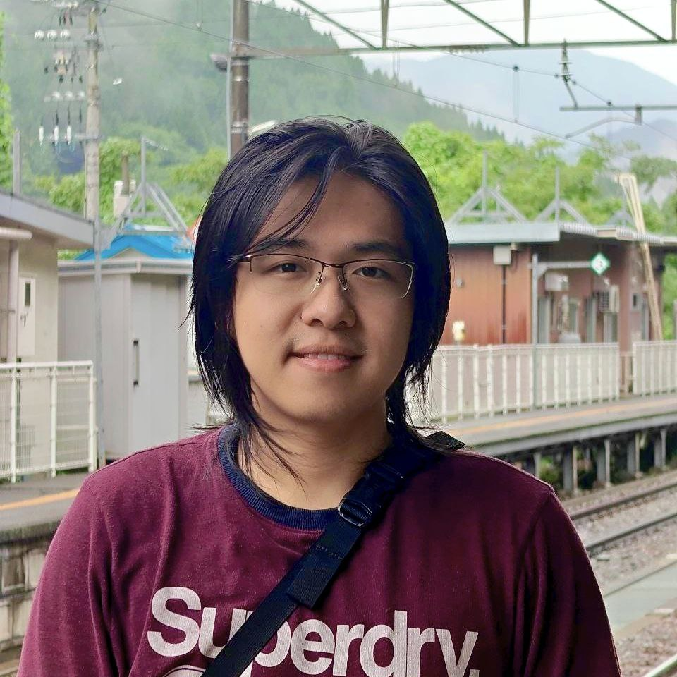

We are a team based in the [School of Computing, National University of Singapore](https://www.comp.nus.edu.sg).

You can reach us at the email `seer[at]comp.nus.edu.sg`

## Project team

### Liangce

[[github](http://github.com/Habutiii)]
[[portfolio](team/habutiii.md)]

* Role: Project Advisor

### Lim Zi Xiong

[[github](http://github.com/lzx-999)]
[[portfolio](team/lzx-999.md)]

* Role: Developer
* Responsibilities: UI

### robinlogic

[[github](http://github.com/robinlogic)] [[portfolio](team/robinlogic.md)]

* Role: Developer
* Responsibilities: Data

### Jason K

[[github](https://github.com/K0p1-Git)]
[[portfolio](team/k0p1-git.md)]

* Role: 10X Developer
* Responsibilities: Dev Ops + Code Quality Assurance

### Megane Wong

[[github](http://github.com/Huffle-Buffle)]
[[portfolio](team/huffle-buffle.md)]

* Role: Developer
* Responsibilities: UI and enhancments
