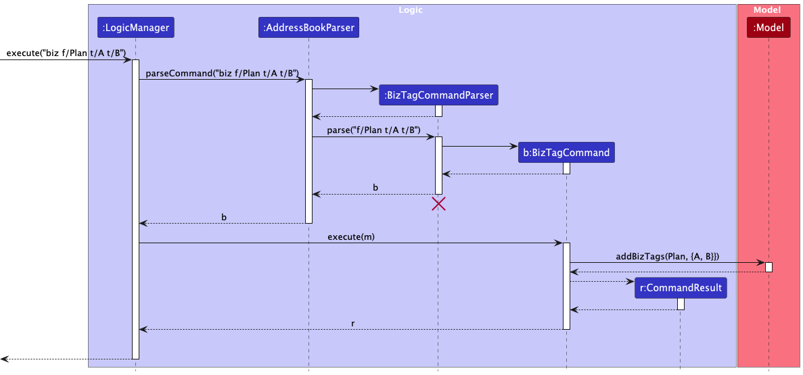

* Table of Contents
{:toc}

--------------------------------------------------------------------------------------------------------------------

## **Acknowledgements**

* Application based on [_SE-EDU AB3_](https://github.com/se-edu/addressbook-level3)
--------------------------------------------------------------------------------------------------------------------

## **Setting up, getting started**

Refer to the guide [_Setting up and getting started_](SettingUp.md).

--------------------------------------------------------------------------------------------------------------------

## **Design**

:bulb: **Tip:** The `.puml` files used to create diagrams are in this document `docs/diagrams` folder. Refer to the [_PlantUML Tutorial_ at se-edu/guides](https://se-education.org/guides/tutorials/plantUml.html) to learn how to create and edit diagrams.

### Architecture

The ***Architecture Diagram*** given above explains the high-level design of the App.

Given below is a quick overview of main components and how they interact with each other.

**Main components of the architecture**

**`Main`** (consisting of classes [`Main`](https://github.com/se-edu/addressbook-level3/tree/master/src/main/java/seedu/address/Main.java) and [`MainApp`](https://github.com/se-edu/addressbook-level3/tree/master/src/main/java/seedu/address/MainApp.java)) is in charge of the app launch and shut down.
* At app launch, it initializes the other components in the correct sequence, and connects them up with each other.
* At shut down, it shuts down the other components and invokes cleanup methods where necessary.

The bulk of the app's work is done by the following four components:

* [**`UI`**](#ui-component): The UI of the App.
* [**`Logic`**](#logic-component): The command executor.
* [**`Model`**](#model-component): Holds the data of the App in memory.
* [**`Storage`**](#storage-component): Reads data from, and writes data to, the hard disk.

[**`Commons`**](#common-classes) represents a collection of classes used by multiple other components.

**How the architecture components interact with each other**

The *Sequence Diagram* below shows how the components interact with each other for the scenario where the user issues the command `delete 1`.

Each of the four main components (also shown in the diagram above),

* defines its *API* in an `interface` with the same name as the Component.
* implements its functionality using a concrete `{Component Name}Manager` class (which follows the corresponding API `interface` mentioned in the previous point.

For example, the `Logic` component defines its API in the `Logic.java` interface and implements its functionality using the `LogicManager.java` class which follows the `Logic` interface. Other components interact with a given component through its interface rather than the concrete class (reason: to prevent outside component's being coupled to the implementation of a component), as illustrated in the (partial) class diagram below.

The sections below give more details of each component.

### UI component

The **API** of this component is specified in [`Ui.java`](https://github.com/se-edu/addressbook-level3/tree/master/src/main/java/seedu/address/ui/Ui.java)

The UI consists of a `MainWindow` that is made up of parts e.g.`CommandBox`, `ResultDisplay`, `PersonListPanel`, `StatusBarFooter` etc. All these, including the `MainWindow`, inherit from the abstract `UiPart` class which captures the commonalities between classes that represent parts of the visible GUI.

The `UI` component uses the JavaFx UI framework. The layout of these UI parts are defined in matching `.fxml` files that are in the `src/main/resources/view` folder. For example, the layout of the [`MainWindow`](https://github.com/se-edu/addressbook-level3/tree/master/src/main/java/seedu/address/ui/MainWindow.java) is specified in [`MainWindow.fxml`](https://github.com/se-edu/addressbook-level3/tree/master/src/main/resources/view/MainWindow.fxml)

The `UI` component,

* executes user commands using the `Logic` component.
* listens for changes to `Model` data so that the UI can be updated with the modified data.
* keeps a reference to the `Logic` component, because the `UI` relies on the `Logic` to execute commands.
* depends on some classes in the `Model` component, as it displays `Person` object residing in the `Model`.

### Logic component

**API** : [`Logic.java`](https://github.com/se-edu/addressbook-level3/tree/master/src/main/java/seedu/address/logic/Logic.java)

Here's a (partial) class diagram of the `Logic` component:

The sequence diagram below illustrates the interactions within the `Logic` component, taking `execute("delete 1")` API call as an example.

:information_source: **Note:** The lifeline for `DeleteCommandParser` should end at the destroy marker (X) but due to a limitation of PlantUML, the lifeline continues till the end of diagram.

How the `Logic` component works:

1. When `Logic` is called upon to execute a command, it is passed to an `AddressBookParser` object which in turn creates a parser that matches the command (e.g., `DeleteCommandParser`) and uses it to parse the command.
1. This results in a `Command` object (more precisely, an object of one of its subclasses e.g., `DeleteCommand`) which is executed by the `LogicManager`.
1. The command can communicate with the `Model` when it is executed (e.g. to delete a person). 
   Note that although this is shown as a single step in the diagram above (for simplicity), in the code it can take several interactions (between the command object and the `Model`) to achieve.
1. The result of the command execution is encapsulated as a `CommandResult` object which is returned back from `Logic`.

Here are the other classes in `Logic` (omitted from the class diagram above) that are used for parsing a user command:

How the parsing works:
* When called upon to parse a user command, the `AddressBookParser` class creates an `XYZCommandParser` (`XYZ` is a placeholder for the specific command name e.g., `AddCommandParser`) which uses the other classes shown above to parse the user command and create a `XYZCommand` object (e.g., `AddCommand`) which the `AddressBookParser` returns back as a `Command` object.
* All `XYZCommandParser` classes (e.g., `AddCommandParser`, `DeleteCommandParser`, ...) inherit from the `Parser` interface so that they can be treated similarly where possible e.g, during testing.

### Model component
**API** : [`Model.java`](https://github.com/se-edu/addressbook-level3/tree/master/src/main/java/seedu/address/model/Model.java)

The `Model` component,

* stores the address book data i.e., all `Person` objects (which are contained in a `UniquePersonList` object).
* stores the currently 'selected' `Person` objects (e.g., results of a search query) as a separate _filtered_ list which is exposed to outsiders as an unmodifiable `ObservableList<Person>` that can be 'observed' e.g. the UI can be bound to this list so that the UI automatically updates when the data in the list change.
* stores a `UserPref` object that represents the user’s preferences. This is exposed to the outside as a `ReadOnlyUserPref` objects.
* does not depend on any of the other three components (as the `Model` represents data entities of the domain, they should make sense on their own without depending on other components)

:information_source: **Note:** An alternative (arguably, a more OOP) model is given below. It has a `Tag` list in the `AddressBook`, which `Person` references. This allows `AddressBook` to only require one `Tag` object per unique tag, instead of each `Person` needing their own `Tag` objects. 

### Storage component

**API** : [`Storage.java`](https://github.com/se-edu/addressbook-level3/tree/master/src/main/java/seedu/address/storage/Storage.java)

The `Storage` component,
* can save both address book data and user preference data in JSON format, and read them back into corresponding objects.
* inherits from both `AddressBookStorage` and `UserPrefStorage`, which means it can be treated as either one (if only the functionality of only one is needed).
* depends on some classes in the `Model` component (because the `Storage` component's job is to save/retrieve objects that belong to the `Model`)

### Common classes

Classes used by multiple components are in the `seedu.address.commons` package.

--------------------------------------------------------------------------------------------------------------------

## **Implementation**

This section describes some noteworthy details on how certain features are implemented.

### Find command

#### Overview
The `find` feature enables insurance agents to search for clients flexibly using multiple keywords and attributes.  
It extends the base AB3 `FindCommand` by supporting **case-insensitive**, **partial matching** across multiple fields: **name**, **phone**, and **email**.

#### Key classes
* `FindCommand` — Executes the search by calling `Model#updateFilteredPersonList(predicate)`.
* `FindCommandParser` — Tokenizes user input and constructs the predicate.
* `ClientMatchesPredicate` — Implements `Predicate<Person>` and encapsulates all matching logic.

#### Behavior
1. User inputs a command such as `find alex 9223`.
2. `LogicManager#execute()` delegates the command string to `AddressBookParser`.
3. `AddressBookParser` recognizes the command word `find` and instantiates a `FindCommandParser`.
4. `FindCommandParser` tokenizes the keywords (`["alex", "9223"]`) and constructs a `ClientMatchesPredicate` object (`p`) that:
    - Ignores blank keywords.
    - Performs **null-safe** access to person fields.
    - Returns `true` if **any** keyword appears in the person's name, phone, or email.
5. A new `FindCommand` object is created with `p` and executed by the `LogicManager`.
6. During execution, `Model#updateFilteredPersonList(p)` is invoked.
7. The model filters the in-memory client list using `ClientMatchesPredicate#test(Person)`, returning all clients that match any of the keywords.

#### Sequence diagram
The following diagram illustrates how the `find` command is processed when a user inputs `find alex 9223`.

:information_source: **Note:**  
The `ClientMatchesPredicate` instance (`p`) is created once and passed to both the `FindCommand` and `Model`.  
This design ensures predictable, stateless filtering and encapsulates all keyword-matching logic within a single class.

#### Example
| User Input       | Description                                                                    |
|------------------|--------------------------------------------------------------------------------|
| `find alex`      | Lists all clients whose name, phone, or email contains “alex”                  |
| `find alex 9223` | Lists all clients whose name, phone, or email contains either “alex” or “9223” |
| `find @gmail`    | Lists all clients with a Gmail address                                         |

#### Design considerations
**Aspect: Matching strategy**
* Use a single `ClientMatchesPredicate` that internally loops through keywords and fields.
    * Pros: Simpler to maintain, easy to test, less object overhead.

---

### Clear feature

Clear feature is implemented via `ClearCommand` class. When the user issues the `clear` command, an instance of `ClearCommand` is created and its `execute` method is called. This method interacts with the `Model` component to remove all entries from the address book. The `Model` provides a method `clearAddressBook()` which is invoked by the `ClearCommand` to perform the actual clearing of data. After clearing, a confirmation message is returned to inform the user that the address book has been successfully cleared.
When executed, the `ClearCommand` will save a copy of the current state of the address book to facilitate the undo feature.

### Biz feature

Biz feature is implemented via `BizTagCommand` class. When the user inputs `biz f/Plan t/A t/B`, an instance of `BizTagCommand` is created and its `execute` method is called.
The object then creates a `FeatureTag` with `tagName` Plan and a `Set<Tag>` containing `Tag`s of `tagName`s A and B. It then passes the `FeatureTag` and `Set<Tag>` into `Model` via the `addBizTags()` method in `Model`.
The object then returns a `String` message to the user about the successful addition. If that Feature already exists in `Model`, this will overwrite that Feature : Tag pair. 

### Unbiz feature

Unbiz feature is implemented via `BizUntagCommand` class. When the user inputs `unbiz f/Plan f/Gender`, an instance of `BizUntagCommand` is created and its `execute` method is called.
The object does the following:
* Check if the Feature after each `f/` exists in `Model` via the `isBizFeature()` method in `Model`. If there are Features that do not exist in `Model`, this command fails and tells the User which Features are missing.
* Else, for each Feature remove them and their Tags from `Model` via the `removeBizFeature()` method in `Model`. Then it returns to the User a `String` confirmation of the removal operation done with which Feature and Tags pair have been removed.

The implementation of the feature is atomic - either all inputted Features get removed or none gets removed. Hence, reducing unexpected changes to the `bizTags` structure in `Model`.

### Stats feature

Stats feature in implemented via the `StatsCommand` class. When the user issues the `stats` command, an instance of `StatsCommand` is created and its `execute` method is called. This method interacts with the `Model` component to obtain declared Features and their respective Tags from `bizTags` using the `get_BizTags()` method in `Model`. It will then aggregate statistics such as Average, Min and Max for each Feature using its own `getFeatureStats()` method and return the output as a `String` through the `CommandResult` object.
This feature is not undoable.

### Undo/redo feature
 
Undo and redo features are implemented using the Command Pattern along with a stack-based approach to track executed commands. Each command that modifies the state of the address book (e.g., add, delete, edit) implements an `undo()` and `redo()` method.

When a mutable command is executed, it is pushed onto an `undoStack`. 
If the user issues an `undo` command, the most recent command is popped from the `undoStack`, its `undo()` method is called to revert the changes, and it is then pushed onto a `redoStack`. 
Conversely, when a `redo` command is issued, the most recent command from the `redoStack` is popped, its `execute(m)` method is called to reapply the changes, and it is pushed back onto the `undoStack`.

The `undo` function in a command will do the opposite of what the `execute` function does.
For example, the `undo` function for the `ClearCommand` will restore all previously deleted entries back into the address book.

Using clear command as an example, the sequence diagram below illustrates how the `undo` feature works:

Using clear command as an example, the sequence diagram below illustrates how the `redo` command works after an `undo` of the clear command has been executed:

### \[Proposed\] Data archiving

_{Explain here how the data archiving feature will be implemented}_

--------------------------------------------------------------------------------------------------------------------

## **Documentation, logging, testing, configuration, dev-ops**

* [Documentation guide](Documentation.md)
* [Testing guide](Testing.md)
* [Logging guide](Logging.md)
* [Configuration guide](Configuration.md)
* [DevOps guide](DevOps.md)

--------------------------------------------------------------------------------------------------------------------

## **Appendix: Requirements**

### Product scope

**Target user profile**:

* independent, tech-savvy insurance agents in Singapore
* has a need to actively manage a mid-sized portfolio of clients
* need a lightweight contact management solution
* prefer desktop apps over other types
* can type fast
* prefers typing to mouse interactions
* is reasonably comfortable using CLI apps

**Value proposition**: optimize contact management for independent agents with a simple, efficient tool.

### User stories

Priorities: High (must have) - `* * *`, Medium (nice to have) - `* *`, Low (unlikely to have) - `*`

| Priority | As a …​                           | I want to …​                                                               | So that I can…​                                                         |
|----------|-----------------------------------|----------------------------------------------------------------------------|-------------------------------------------------------------------------|
| `* * *`  | Insurance Agent                   | find clients using attributes other than name (e.g., uid, email, phone)    | locate clients more flexibly                                            |
| `* * *`  | Insurance Agent                   | view client details and insurance premium                                  | keep track of my client details                                         |
| `* * *`  | Insurance Agent                   | add a new client’s contact information                                     | maintain an up-to-date client list                                      |
| `* * *`  | Insurance Agent                   | edit a client’s details                                                    | quickly update changes like phone numbers or address                    |
| `* * *`  | Insurance Agent                   | avoid adding duplicate clients                                             | avoid keeping the same person twice                                     |
| `* * *`  | Insurance Agent                   | delete contacts                                                            | keep my contact list clean and relevant                                 |
| `* * *`  | Insurance Agent (First-time user) | access a command guide (main page)                                         | learn or recall the command formats quickly                             |
| `* * *`  | Insurance Agent                   | save client details                                                        | ensure client details will not go missing                               |
| `* * *`  | Analytical Insurance Agent        | view a summary of plans purchased and customer statistics                  | quickly analyse the demographics of clients                             |
| `* *`    | Experienced Insurance Agent       | tag clients (e.g., “priority”, “prospect”, “policyholder”)                 | organise my portfolio logically                                         |
| `* *`    | Insurance Agent                   | view tags as folders                                                       | group and browse clients by relationship or category                    |
| `* *`    | Insurance Agent                   | undo my mistake while using the application                                | rectify errors without re-editing an entry                              |
| `* *`    | Insurance Agent                   | sort clients based on attributes (e.g., name, date added)                  | quickly update changes like phone numbers or addresses                  |
| `* *`    | Insurance Agent                   | see a live preview of client input while adding/editing                    | know immediately if I missed a field                                    |
| `* *`    | Insurance Agent                   | perform multi-entry actions (e.g., delete multiple clients in one command) | save time when cleaning up data                                         |
| `* *`    | Insurance Agent                   | import/export to excel                                                     | view data in excel and share with others                                |
| `* *`    | Insurance Agent                   | get a warning before dangerous action                                      | avoid losing client details by accident                                 |
| `*`      | Insurance Agent                   | use aliases for commands (e.g., ls for list)                               | work faster without clashing with existing commands                     |
| `*`      | Insurance Agent                   | use AI assistant to deep analysis on my data                               | uncover invaluable insights                                             |
| `*`      | Insurance Agent                   | ask AI to perform actions on the application                               | save time and manual labour                                             |
| `*`      | Insurance Agent                   | build schedule for all my meetings                                         | keep track of my schedule in a single application                       |
| `*`      | Insurance Agent                   | auto-calculate insurance premium per term                                  | quickly know how much the client has/will be paying over the term years |

*{More to be added}*

### Use cases

(For all use cases below, the **System** is the `AddressBook` and the **Actor** is the `user`, unless specified otherwise)

### Use case: `add`

> **Example 1**  
> **System:** Insurance Management App  
> **Actor:** Insurance Agent  
>
> **MSS:**  
> 1. Agent issues add n/NAME p/PHONE e/EMAIL a/ADDRESS [t/TAG]... command.  
> 2. System validates each parameter.  
> 3. System checks for duplicates using (name + phone).  
> 4. If valid, system creates a new client entry and updates the display.  
>    - Use case ends.  
>
> **Extensions:**  
> - 2a. Missing required fields.  
>   - 2a1. System displays: “ERROR: Missing required fields. Required: n/, p/, e/, a/.”  
>   - Use case ends.  
>
> - 2b. Invalid parameter format.  
>   - 2b1. System displays specific error message (e.g., “Phone must be a valid number”).  
>   - 2b2. Agent corrects input.  
>   - Use case resumes from step 2.  
>
> - 3a. Duplicate detected.  
>   - 3a1. System displays: “DUPLICATE CLIENT: A client with the same phone/email already exists.”  
>   - 3a2. Agent may use edit INDEX instead.  
>   - Use case ends.  

---

### Use case: `edit`

> **System:** Insurance Management App  
> **Actor:** Insurance Agent  
>
> **MSS:**  
> 1. Agent issues edit INDEX [n/NAME] [p/PHONE] [e/EMAIL] [a/ADDRESS] [t/TAG]... command.  
> 2. System validates the index and input fields.  
> 3. System checks for duplicates (name + phone).  
> 4. If valid, system updates client details and displays confirmation.  
>    - Use case ends.  
>
> **Extensions:**  
> - 2a. Index out of bounds.  
>   - 2a1. System displays error: “Index not found.”  
>   - Use case ends.  
>
> - 2b. Invalid parameter format.  
>   - 2b1. System displays error specifying invalid field.  
>   - 2b2. Agent corrects input.  
>   - Use case resumes from step 2.  
>
> - 3a. Duplicate detected.  
>   - 3a1. System displays duplicate warning.  
>   - Use case ends.  
>
> - 4a. Tag replacement error.  
>   - 4a1. System rejects entire edit if one invalid tag is found.  
>   - Use case ends.  
>
> - 4b. Storage failure occurs.  
>   - 4b1. System displays: “Couldn’t save data. Your edit was cancelled.”  
>   - Use case ends.  

---

### Use case: `delete`

> **System:** Insurance Management App  
> **Actor:** Insurance Agent  
>
> **MSS:**  
> 1. Agent issues delete INDEX command.  
> 2. System verifies the index.  
> 3. System deletes the client record at that index.  
> 4. System displays confirmation: “Deleted Person: <Client details>”.  
>    - Use case ends.  
>
> **Extensions:**  
> - 2a. Index out of bounds.  
>   - 2a1. System displays error: “Index not found.”  
>   - Use case ends.  

---

### Use case: `find`

> **System:** Insurance Management App  
> **Actor:** Insurance Agent  
>
> **MSS:**  
> 1. Agent issues find STRING command.  
> 2. System searches client records by name, UID, email, or phone.  
> 3. System returns matching records in a tabular list (CLI) or as clickable results (GUI).  
> 4. Agent views or selects the desired client record.  
>    - Use case ends.  
>
> **Extensions:**  
> - 2a. No matches found.  
>   - 2a1. System displays: “No clients matched the provided filters.”  
>   - Use case ends.  
>
> - 2b. Invalid parameter provided (e.g., malformed input).  
>   - 2b1. System displays error specifying the issue (e.g., invalid characters).  
>   - 2b2. Agent re-enters correct input.  
>   - Use case resumes from step 2.  
>
> - 2c. Conflicting filters applied.  
>   - 2c1. System displays: "No clients matched all provided filters."  
>   - Use case ends.  

---

### Use case: `help`

> **System:** Insurance Management App  
> **Actor:** Insurance Agent  
>
> **MSS:**  
> 1. Agent issues help command.  
> 2. System displays a list of commands with usage details.  
> 3. Agent reads and continues working.  
>    - Use case ends.  
>
> **Extensions:**  
> - 1a. Agent types synonym (e.g., guide, man).  
>   - 1a1. System displays: “Unknown command. Type help to see available commands.”  
>   - Use case ends.  

---

### Use case: `stats`

> **System:** Insurance Management App  
> **Actor:** Insurance Agent  
>
> **MSS:**  
> 1. Agent issues stats command.  
> 2. System analyses customer data.  
> 3. System displays summary table (Packages vs. No. of Customers).  
> 4. Agent reviews performance insights.  
>    - Use case ends.  
>
> **Extensions:**  
> - 2a. No data available.  
>   - 2a1. System displays: “No statistics available – no clients found.”  
>   - Use case ends.  

---

### Use case: `list`

> **Example 1**  
> **System:** Insurance Management App  
> **Actor:** Insurance Agent  
>
> **MSS:**  
> 1. Agent issues list command.  
> 2. System displays all the persons in the address book.  
> 3. Use case ends.  

### Non-Functional Requirements

1. Should work on any _mainstream OS_ as long as it has Java `17` or above installed.
2. Should be able to hold up to 1000 persons without a noticeable sluggishness in performance for typical usage.
3. A user with above average typing speed for regular English text (i.e. not code, not system admin commands) should be able to accomplish most of the tasks faster using commands than using the mouse.
4. A user should be able to pull up a customer's records in the shortest time possible.
5. User's customer data should be stored in a human-editable format (JSON).
6. The GUIs should work well for standard screen resolutions (1920 by 1080) and scales between 100% and 125%.
7. The GUIs should be uncluttered and easy on the eyes of the user.
8. The help page for the app's usage parameters should be easily accessible.
9. The UI should be designed to minimize cognitive load, ensuring that users can quickly identify the features they need without excessive searching or confusion.
10. The app should be packaged into a single file.

*{More to be added}*

### Glossary

* **Mainstream OS**: Windows, Linux, Unix, MacOS
* **Private contact detail**: Contact Liangce @Habutiii if you have any queries

* AddressBook: The core system being developed is a lightweight contact management application for independent ethical insurance agents.
* Actor: A user (typically Insurance Agent) or external entity that interacts with the system.
* Analytical Insurance Agent: A type of user who wants to analyse client demographics, insurance plans and overall portfolio statistics.
* Client: An individual whose personal and insurance details are stored and managed in the AddressBook (AB3).
* Command Guide: A reference page within the application that shows all available commands and their formats.
* Contact Detail: Any piece of information related to a client, such as name, phone number, email or insurance details.
* Duplicate Client: An entry in the AddressBook that repeats an existing client’s details.
* GUI (Graphical User Interface): The visual interface of the application, allowing users to interact with the AddressBook via windows, buttons and other graphical elements.
* Human-editable format (JSON): A structured text format (JavaScript Object Notation) used to store client data, which can be read and edited directly by users.
* Insurance Premium: The regular payment made by a client for their insurance coverage.
* Non-Functional Requirement (NFR): A requirement that specifies system quality or constraints (e.g., performance, usability, storage format), rather than a specific feature.
* Tag: A label attached to a client (e.g., “priority”, “prospect”, “policyholder”) that helps agents organize and filter their portfolio.
* Undo: A feature allowing the user to revert a mistaken action (e.g., wrong edit or deletion).

--------------------------------------------------------------------------------------------------------------------

## **Appendix: Instructions for manual testing**

Given below are instructions to test the app manually.

:information_source: **Note:** These instructions only provide a starting point for testers to work on;
testers are expected to do more *exploratory* testing.

### Launch and shutdown

1. Initial launch

   1. Download the jar file and copy into an empty folder

   1. Double-click the jar file Expected: Shows the GUI with a set of sample contacts. The window size may not be optimum.

1. Saving window preferences

   1. Resize the window to an optimum size. Move the window to a different location. Close the window.

   1. Re-launch the app by double-clicking the jar file. 
       Expected: The most recent window size and location is retained.

1. _{ more test cases …​ }_

### Deleting a person

1. Deleting a person while all persons are being shown

   1. Prerequisites: List all persons using the `list` command. Multiple persons in the list.

   1. Test case: `delete 1` 
      Expected: First contact is deleted from the list. Details of the deleted contact shown in the status message. Timestamp in the status bar is updated.

   1. Test case: `delete 0` 
      Expected: No person is deleted. Error details shown in the status message. Status bar remains the same.

   1. Other incorrect delete commands to try: `delete`, `delete x`, `...` (where x is larger than the list size) 
      Expected: Similar to previous.

1. _{ more test cases …​ }_

### Saving data

1. Dealing with missing/corrupted data files

   1. _{explain how to simulate a missing/corrupted file, and the expected behavior}_

1. _{ more test cases …​ }_
