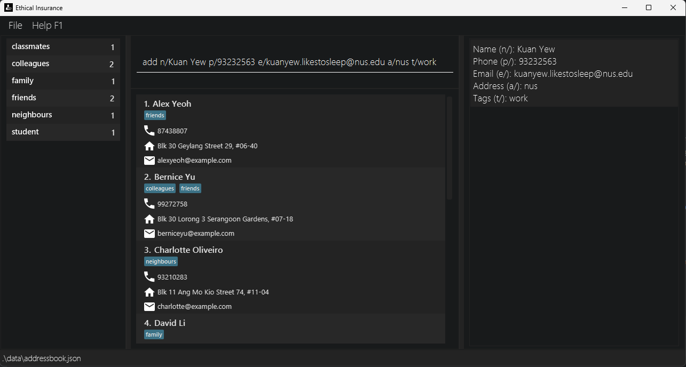
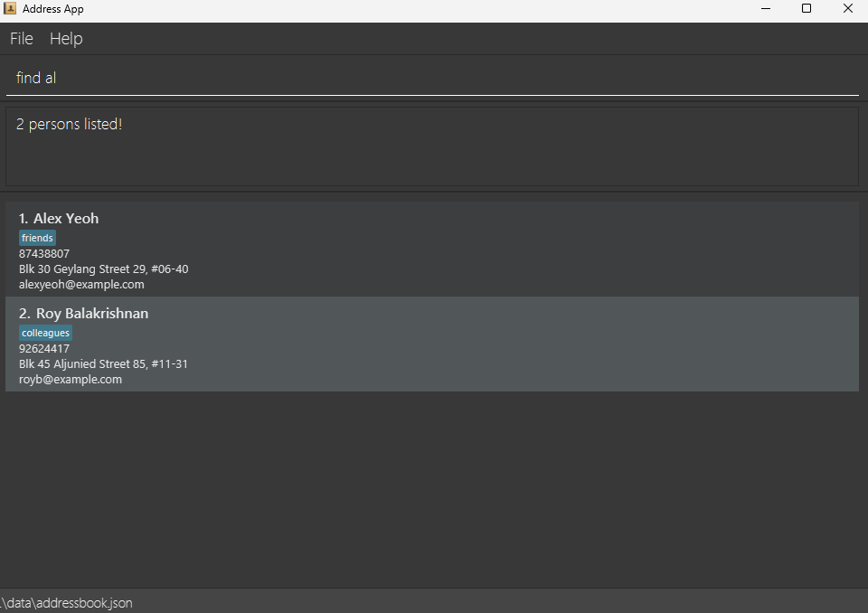
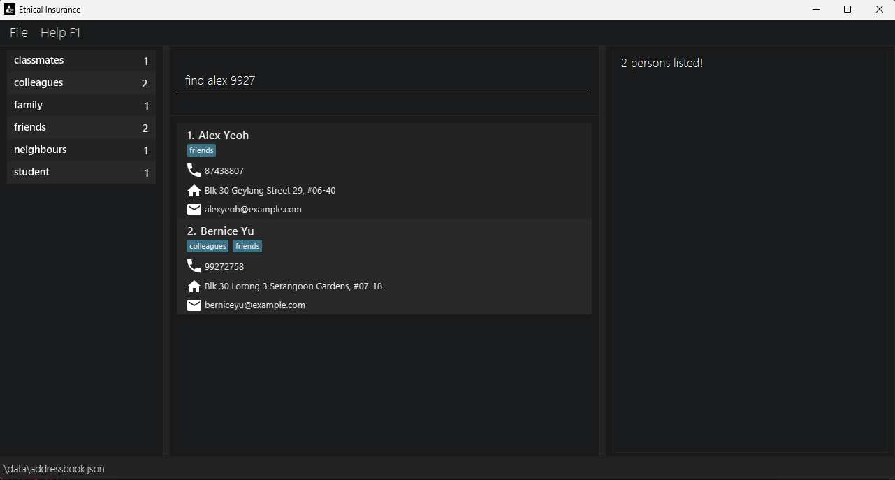

Ethical Insurance is a lightweight desktop contact management tool optimized for independent insurance agents.

* Table of Contents
{:toc}

--------------------------------------------------------------------------------------------------------------------

## Quick start

1. Ensure you have Java `17` or above installed in your Computer. 
   **Mac users:** Ensure you have the precise JDK version prescribed [here](https://se-education.org/guides/tutorials/javaInstallationMac.html).

1. Download the latest `.jar` file from [here](https://github.com/AY2526S1-CS2103-F13-2/tp/releases).

1. Copy the file to the folder you want to use as the _home folder_ for your AddressBook.

1. Open a command terminal, `cd` into the folder you put the jar file in, and use the `java -jar addressbook.jar` command to run the application. 
   A GUI similar to the below should appear in a few seconds. Note how the app contains some sample data. 
   

1. Type the command in the command box and press Enter to execute it. e.g. typing **`help`** and pressing Enter will open the help window. 
   Some example commands you can try:

   * `list` : Lists all contacts.

   * `add n/John Doe p/98765432 e/johnd@example.com a/John street, block 123, #01-01` : Adds a contact named `John Doe` to the Address Book.

   * `delete 3` : Deletes the 3rd contact shown in the current list.

   * `clear` : Deletes all contacts.

   * `exit` : Exits the app.

1. Refer to the [Features](#features) below for details of each command.

--------------------------------------------------------------------------------------------------------------------

## Features

**:information_source: Notes about the command format:** 

* Words in `UPPER_CASE` are the parameters to be supplied by the user. 
  e.g. in `add n/NAME`, `NAME` is a parameter which can be used as `add n/John Doe`.

* Items in square brackets are optional. 
  e.g `n/NAME [t/TAG]` can be used as `n/John Doe t/friend` or as `n/John Doe`.

* Items with `…`​ after them can be used multiple times including zero times. 
  e.g. `[t/TAG]…​` can be used as ` ` (i.e. 0 times), `t/friend`, `t/friend t/family` etc.

* Parameters can be in any order. 
  e.g. if the command specifies `n/NAME p/PHONE_NUMBER`, `p/PHONE_NUMBER n/NAME` is also acceptable.

* Extraneous parameters for commands that do not take in parameters (such as `help`, `list`, `exit` and `clear`) will be ignored. 
  e.g. if the command specifies `help 123`, it will be interpreted as `help`.

* If you are using a PDF version of this document, be careful when copying and pasting commands that span multiple lines as space characters surrounding line-breaks may be omitted when copied over to the application.

### Viewing Manuals: `man`

Shows manuals for commands.

Format: `man [COMMAND]`
* If `COMMAND` is not specified, shows a list of all available commands.
* If `COMMAND` is specified, shows the manual for the command.

### Viewing help : `help`

Shows a message explaining how to access the help page.

Format: `help`

### Adding a person: `add`

Adds a person to the address book.

Format: `add n/NAME p/PHONE_NUMBER e/EMAIL a/ADDRESS [t/TAG]…​`

* Another person entry with the same `NAME` and `PHONE_NUMBER` is treated as a duplicate entry.

:bulb: **Tip:**
A person can have any number of tags (including 0)

Examples:
* `add n/John Doe p/98765432 e/johnd@example.com a/John street, block 123, #01-01`
* `add n/Betsy Crowe t/friend e/betsycrowe@example.com a/Newgate Prison p/1234567 t/criminal`

### Listing all persons : `list`

Shows a list of all persons in the address book.

Format: `list`

### Sort list by tag : `list t/<your tag here>`

Sorts and lists only entries with the respective tag(s) entered.

Format: `list t/<your tag here>` and for multiple tags `list t/<your tag here> t/<your tag here> ...`

### Editing a person : `edit`

Edits an existing person in the address book.

Format: `edit INDEX [n/NAME] [p/PHONE] [e/EMAIL] [a/ADDRESS] [t/TAG]…​`

* Edits the person at the specified `INDEX`. The index refers to the index number shown in the displayed person list. The index **must be a positive integer** 1, 2, 3, …​
* At least one of the optional fields must be provided.
* Existing values will be updated to the input values.
* When editing tags, the existing tags of the person will be removed i.e adding of tags is not cumulative.
* You can remove all the person’s tags by typing `t/` without
    specifying any tags after it.

Examples:
*  `edit 1 p/91234567 e/johndoe@example.com` Edits the phone number and email address of the 1st person to be `91234567` and `johndoe@example.com` respectively.
*  `edit 2 n/Betsy Crower t/` Edits the name of the 2nd person to be `Betsy Crower` and clears all existing tags.

### Locating persons by name: `find`

Finds clients whose **name, phone number, or email** contain any of the given keywords (case-insensitive, partial matches allowed).
Format: `find KEYWORD [MORE_KEYWORDS]`

**Details:**
* The search is **case-insensitive**.  
  e.g. `hans` will match `Hans`, `HANS`, or `Johanssen`
* **Partial matches** are supported.  
  e.g. `li` will match `David Li`, `Lina Tan`, and `charlie@gmail.com`
* The search covers **name**, **phone**, and **email** fields.
* The order of the keywords does **not** matter.  
  e.g. `Alex 9123` returns all clients with “Alex” in their name or “9123” in their phone number.
* Matching uses **OR semantics** – a client is listed if **any** keyword matches any searchable field.
* Blank or invalid inputs (e.g. only spaces or non-printable Unicode) are safely ignored.

---

**Examples:**

| Command                    | Description / Result                                                      |
|----------------------------|---------------------------------------------------------------------------|
| `find alex`                | Returns all clients with “alex” in their name, phone, or email.           |
| `find 9123`                | Returns clients whose phone number contains `9123`.                       |
| `find gmail.com`           | Returns clients using Gmail addresses.                                    |
| `find alex 9123 gmail.com` | Returns any client whose name, phone, or email contains any of the terms. |

Examples:
* `find al` returns `Alex Yeow` and `Roy Balakrishnan`
    

* `find alex 9927` returns `Alex Yeoh`, `Bernice Yu` 
    

### Deleting a person : `delete`

Deletes the specified person from the address book.

Format: `delete INDEX`

* Deletes the person at the specified `INDEX`.
* The index refers to the index number shown in the displayed person list.
* The index **must be a positive integer** 1, 2, 3, …​

Examples:
* `list` followed by `delete 2` deletes the 2nd person in the address book.
* `find Betsy` followed by `delete 1` deletes the 1st person in the results of the `find` command.

### Clearing all entries : `clear`

Clears all entries from the address book.

Format: `clear`

### Viewing Summary Statistics: `stats`

Shows Summary Statistics on Customers in the address book.

Format: `stats`

**Example:**

| Command | `stats`                                                 |
|---------|---------------------------------------------------------|
| Output  | Number of Customers: 6   #More stats coming soon... |

### Undoing the last action : `undo`

Reverts the most recent mutable action (add, delete, clear, or edit) performed during the current runtime.

Format: `undo`

* Only actions that change the address book (add, delete, clear, edit) can be undone.
* Multiple undo operations can be performed in sequence to revert several actions, as long as they are all mutable actions from the current session.
* Undo is only available for actions performed since the application was started (current runtime).

**Examples:**
* After adding a person, running `undo` will remove the newly added person.
* After deleting a person, running `undo` will restore the deleted person.
* After editing a person, running `undo` will revert the changes made.
* After clearing the address book, running `undo` will restore all previously deleted entries.

---

### Redoing the last undone action : `redo`

Reapplies the most recent sequence of undone mutable actions, as long as no new action has been performed since the last undo.

Format: `redo`

* Only actions that were previously undone using `undo` can be redone.
* If you perform a new action (add, delete, clear, edit) after undoing, the redo history is cleared and you cannot redo the previous actions.
* Multiple redo operations can be performed in sequence to reapply several undone actions, as long as no new action has interrupted the sequence.

**Examples:**
* After undoing an add, running `redo` will add the person back again.
* After undoing a delete, running `redo` will delete the person again.
* If you undo an edit and then perform a new add, you cannot redo the undone edit.

### Exiting the program : `exit`

Exits the program.

Format: `exit`

### Saving the data

AddressBook data are saved in the hard disk automatically after any command that changes the data. There is no need to save manually.

### Editing the data file

AddressBook data are saved automatically as a JSON file `[JAR file location]/data/addressbook.json`. Advanced users are welcome to update data directly by editing that data file.

:exclamation: **Caution:**
If your changes to the data file makes its format invalid, AddressBook will discard all data and start with an empty data file at the next run. Hence, it is recommended to take a backup of the file before editing it. 
Furthermore, certain edits can cause the AddressBook to behave in unexpected ways (e.g., if a value entered is outside of the acceptable range). Therefore, edit the data file only if you are confident that you can update it correctly.

### Archiving data files `[coming in v2.0]`

_Details coming soon ..._

--------------------------------------------------------------------------------------------------------------------

## FAQ

**Q**: How do I transfer my data to another Computer? 
**A**: Install the app in the other computer and overwrite the empty data file it creates with the file that contains the data of your previous AddressBook home folder.

--------------------------------------------------------------------------------------------------------------------

## Known issues

1. **When using multiple screens**, if you move the application to a secondary screen, and later switch to using only the primary screen, the GUI will open off-screen. The remedy is to delete the `preferences.json` file created by the application before running the application again.
2. **If you minimize the Help Window** and then run the `help` command (or use the `Help` menu, or the keyboard shortcut `F1`) again, the original Help Window will remain minimized, and no new Help Window will appear. The remedy is to manually restore the minimized Help Window.

--------------------------------------------------------------------------------------------------------------------

## Command summary

Action | Format, Examples
--------|------------------
**Add** | `add n/NAME p/PHONE_NUMBER e/EMAIL a/ADDRESS [t/TAG]…​`   e.g., `add n/James Ho p/22224444 e/jamesho@example.com a/123, Clementi Rd, 1234665 t/friend t/colleague`
**Clear** | `clear`
**Delete** | `delete INDEX`  e.g., `delete 3`
**Edit** | `edit INDEX [n/NAME] [p/PHONE_NUMBER] [e/EMAIL] [a/ADDRESS] [t/TAG]…​`  e.g.,`edit 2 n/James Lee e/jameslee@example.com`
**Find** | `find KEYWORD [MORE_KEYWORDS]`  e.g., `find James Jake`
**List** | `list`
**Help** | `help`
**Sort by tag** | `list t/<your tag here>`   e.g., `list t/friends`
**Stats**| `stats`
**Undo** | `undo`
**Redo** | `redo`

