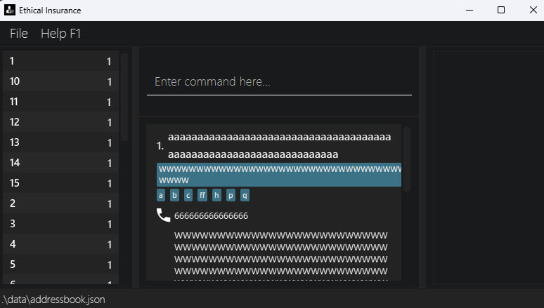

**:information_source: About Ethical Insurance:**

Ethical Insurance is a lightweight desktop contact management tool, a modernised version of the original AddressBook application, specifically tailored for independent insurance agents managing 0 – 1000 customer entries.

Throughout this User Guide, any mention of **“Address Book”** refers to the **Ethical Insurance** application itself. Both terms may be used interchangeably.

* Table of Contents
{:toc}

--------------------------------------------------------------------------------------------------------------------

## Quick start

1. Ensure you have Java `17` or above installed in your Computer. 
   **Mac users:** Ensure you have the precise JDK version prescribed [here](https://se-education.org/guides/tutorials/javaInstallationMac.html).

1. Download the latest `.jar` file from [here](https://github.com/AY2526S1-CS2103-F13-2/tp/releases).

1. Copy the file to the folder you want to use as the _home folder_ for your Ethical Insurance.

1. Open a command terminal, `cd` into the folder you put the jar file in, and use the `java -jar Ethical-Insurance.jar` command to run the application. 
   A GUI similar to the below should appear in a few seconds. Note how the app contains some sample data. 
   

1. Type the command in the command box and press Enter to execute it. e.g. typing **`help`** and pressing Enter will open the help window. 
   Some example commands you can try:

    * `list` : Lists all contacts.

    * `add n/John Doe p/98765432 e/johnd@example.com a/John street, block 123, #01-01` : Adds a contact named `John Doe` to the Address Book.

    * `delete 3` : Deletes the 3rd contact shown in the current list.

    * `clear` : Deletes all contacts.

    * `exit` : Exits the app.
    
    * `man` : Manual guide to get you started.

1. Refer to the [Features](#features) below for details of each command.

--------------------------------------------------------------------------------------------------------------------

## Keybinds

The following keybinds are available in Ethical Insurance

- Up Arrow (↑): Goes back to previous command in history.
- Down Arrow (↓): Goes forward to next command in history or empties command box when reach the end of history.

--------------------------------------------------------------------------------------------------------------------

## Features

:exclamation: **Caution:**

All commands and parameters are case sensitive. For example, `add` is a valid command, whereas `Add` or `ADD` are not recognized as valid commands.

| Rule                               | Description                                                                                                                                                                                                                                                             | Example                                                                           |
|------------------------------------|-------------------------------------------------------------------------------------------------------------------------------------------------------------------------------------------------------------------------------------------------------------------------|-----------------------------------------------------------------------------------|
| **Parameters in `UPPER_CASE`**     | Must be supplied by the user.                                                                                                                                                                                                                                           | `add n/NAME` → `add n/John Doe`                                                   |
| **Items in square brackets `[ ]`** | Are optional.                                                                                                                                                                                                                                                           | `n/NAME [t/TAG]` → `n/John Doe t/friend` or `n/John Doe`                          |
| **Items followed by `…`**          | Can be repeated multiple times (including zero).                                                                                                                                                                                                                        | `[t/TAG]…` → none, `t/friend`, `t/friend t/family` (up to **15 tags**)            |
| **Parameter order**                | Parameters can appear in any order.                                                                                                                                                                                                                                     | `n/NAME p/PHONE_NUMBER` = `p/PHONE_NUMBER n/NAME`                                 |
| **Extra parameters**               | Ignored for commands that take none (`help`, `exit`, `clear`, `undo`, `redo`).                                                                                                                                                                                          | `help 123` → interpreted as `help`, `list t/a s/abcd` is treated as `list t/a s/` |
| **Leading/Trailing spaces**        | Leading and trailing spaces are ignored.                                                                                                                                                                                                                                | "   add n/ John ..." → "add n/John ..."                                           |
| **PDF copy-paste tip**             | Certain characters in this document may appear stylised (e.g. quotes, dashes, or spaces) and may not be recognised by the application. Ethical Insurance only accepts <strong>printable ASCII characters</strong>. Please type commands manually to avoid input errors. | —                                                                                 |

---

## Commands

This section explains how to read and use command syntax throughout the User Guide

### Viewing Manuals: `man`

Display help manual for commands.

Format: `man [COMMAND]`
* If `COMMAND` is not specified, shows a list of all available commands.
* If `COMMAND` is specified, shows the manual for the command.
* If multiple inputs are entered (e.g., man list help), only the first valid command (list) will be processed, and everything else after the first space will be ignored.

---

### Viewing help : `help`

Shows a message explaining how to access the help page.

Format: `help`

---

### Listing all persons : `list`

Shows a list of all persons in the address book.

Format: `list`

**Filtered list by tag : `list t/<your tag here>`**

Sorts and lists only entries with the respective tag(s) entered.

Format: `list t/<your tag here>` and for multiple tags `list t/<your tag here> t/<your tag here> ...`

**Create folder by tag : `list t/<your tag here> s/`**

Create and save custom folder.

Format: `list t/<your tag here> s/` and for multiple tags `list t/<your tag here> t/<your tag here> ... s/`
Output will be a folder with the names of the tags you have selected.
Example:
- Input: list t/friends t/colleagues s/
- Output: Folder friends & colleagues created

**Delete folder by tag : `list t/<your tag here> d/`**

Delete selected folder. Order does not matter for the deleting of folder, as long as
the respective tags are that folder will be deleted.

Format: `list t/<your tag here> d/` and for multiple tags `list t/<your tag here> t/<your tag here> ... d/`

---

### Adding a person: `add`
>All parameters must contain only printable ASCII characters.

Adds a person to the address book.

Format: `add n/NAME p/PHONE_NUMBER e/EMAIL a/ADDRESS [t/TAG]…​`

**Examples**

* `add n/John Doe p/98765432 e/johnd@example.com a/John street, block 123, #01-01`
* `add n/Betsy Crowe t/friend e/betsycrowe@example.com a/Newgate Prison p/1234567 t/criminal`

<strong>:information_source: Tip:</strong>
A person can have any number of tags (including 0).

:exclamation: <strong>Caution:</strong>
Another person with the same <code>NAME</code> (case-insensitive) and <code>PHONE_NUMBER</code> is treated as a duplicate entry. Duplicate entries are not allowed in the address book.

**Parameters must adhere to the following restrictions:**

**Name:**

- May only contain English letters (A–Z, a–z) and;
- Can contain **letters**, **spaces**, and the following special characters only:  
  `(space) , ( ) / . @ - '`
- A name should also not exceed 100 characters.
- Cannot contain **numbers** inside the name or any other special symbols.

**Examples**

| Valid       | Invalid      |
|-------------|--------------|
| Jean-Luc    | John123      |
| Tan         | Strauß       |
| Mei Ling    | José         |
| O'Connor    | John*        |
| Mary (Ann)  | John_        |
| Alex @ Home | _xXdarrenXx_ |

**Phone:**
- Must be **3–15 digits** (to account for international numbers).
- Only digits (0–9) are allowed — **no spaces, letters, or symbols eg.`+`.**

**:information_source: Notes about the restrictions:**

The phone number must be between 3 and 15 digits long.
Shortcodes are usually 3 to 5 digits long.
International numbers are usually up to 15 digits long by ITU-T E.164 standard.

Thus, we set the minimum length to 3 and maximum length to 15.
The phone number should only contain digits.

**Examples**

| Valid           | Invalid      |
|-----------------|--------------|
| 94567802        | +65 98765432 |
| 82684533        | phone123     |
| 66265555        | 9011p041     |
| 123456789012345 | 9312 1534    |

**Email:**
- Must be a **valid email address**, with:
    - An alphanumeric username
    - Optional special characters (`+`, `_`, `.`, `-`)
    - An `@` followed by a valid domain name

**Examples**

| Valid                  | Invalid         |
|------------------------|-----------------|
| johndoe@example.com    | johndoe@        |
| alice.smith-99@mail.co | alice@@mail.com |
| user+test@abc-def.com  | bob@mail.       |
| user@mail              | user@a.a        |

**Address:**
- Must **not be blank**.
- Only printable ASCII characters allowed.

**Examples**

| Valid                        | Invalid                       |
|------------------------------|-------------------------------|
| 123 Main St, Block 5, #01-01 | " "                           |
| 42 Wallaby Way               | " Blk 456, Den Road, #01-355" |
| 7th Avenue, Apt 3            | "Blk 456, Den Road, #01-355 " |

**Tag(s):**
- Tags are optional.
- Each person can have **up to 15 tags**.
- Tags can only contain **letters**, **numbers**, and **dashes (`-`)**.
- Tags are case-insensitive. Must not exceed 40 characters.

**Examples**

| Valid         | Invalid       |
|---------------|---------------|
| friend        | friend!       |
| family-member | family_member |
| project2025   | Project@2025  |

---

### Editing a person : `edit`

Updates an existing person’s details in the address book.

**Format:**  
`edit INDEX [n/NAME] [p/PHONE] [e/EMAIL] [a/ADDRESS] [{t/ | at/ | dt/}TAG]...`

<strong>:information_source: Notes:</strong>
<code>INDEX</code> refers to the number shown in the <strong>current list view</strong>, not a fixed ID. 
If you used <code>find</code> or <code>list</code> before, <code>edit 1</code> edits the first result from that filtered list.

**Description**

* Edits the person at the specified `INDEX` in the currently displayed list.  
  The index **must be a positive integer** (1, 2, 3, …).
* At least one of the optional fields must be provided (i.e. `n/`, `p/`, `e/`, `a/`, or `t/`).
* Only the specified fields will be updated; all other details remain unchanged.
* When editing tags (`t/`, `at/`, `dt/`):
  * `at/` adds new tags to existing ones. 
  * `dt/` removes specified tags from existing ones.
  * `t/` replaces all existing tags with the new set of tags provided.
  * To remove all tags, type `t/` with nothing after it.
  * Only one unique tag operation (t/, at/, or dt/) can be used per command. (See examples below)
    * The selected unique tag operation can be repeated multiple times in the same command to add/remove multiple tags.
* Each person can have up to **15 tags** after editing.
* **Parameter restrictions:** Same as those in the [`add`](#adding-a-person-add) command.

**Examples**

| Command                                   | Description                                                          |
|-------------------------------------------|----------------------------------------------------------------------|
| `edit 1 p/91234567 e/johndoe@example.com` | Updates the **phone** and **email** of the 1st person.               |
| `edit 2 n/Betsy Crower t/`                | Changes the **name** of the 2nd person and clears all existing tags. |
| `edit 3 at/InsuranceA`                    | Adds the tag **InsuranceA** to the 3rd person’s existing tags.       |
| `edit 3 dt/InsuranceA`                    | Removes the tag **InsuranceA** from the 3rd person’s existing tags.  |
| `edit 4 at/tag1 at/tag2 at/tag3`          | Adds the tags **tag1**, **tag2**, and **tag3** to the 4th person.    |

---

### Locating persons by name: `find`

Finds clients whose **name, phone number, or email** contain any of the given keywords (case-insensitive, partial matches allowed).
Format: `find KEYWORD [MORE_KEYWORDS]`

**Description**

- The search is **case-insensitive**.  
  Example: `hans` matches `Hans`, `HANS`, and `Johanssen`.
- **Partial matches** are supported.  
  Example: `li` matches `David Li`, `Lina Tan`, and `charlie@gmail.com`.
- Searches across **name**, **phone**, and **email** fields.
- Keyword order **does not matter**.  
  Example: `Alex 9123` matches clients whose name contains “Alex” or phone contains “9123”.
- Uses **OR semantics** — a client is listed if **any** keyword matches any field.
- Blank or invalid inputs (e.g., spaces only or non-printable Unicode) are ignored safely.

**Examples**

| Command                    | Description / Result                                                |
|----------------------------|---------------------------------------------------------------------|
| `find alex`                | Lists all clients with “alex” in their name, phone, or email.       |
| `find 9123`                | Lists clients whose phone number contains “9123”.                   |
| `find gmail.com`           | Lists clients using Gmail addresses.                                |
| `find alex 9123 gmail.com` | Lists clients whose name, phone, or email matches any of the terms. |

<strong>:information_source: Example:</strong>
<code>find al</code> returns <code>Alex Yeow</code> and <code>Roy Balakrishnan</code>.

<strong>:information_source: Example:</strong>
<code>find alex 9927</code> returns <code>Alex Yeoh</code>, <code>Bernice Yu</code>.

---

### Deleting a person : `delete`

Deletes the specified person from the address book.

Format: `delete INDEX`

* Deletes the person at the specified `INDEX`.
* The index refers to the index number shown in the displayed person list.
* The index **must be a positive integer** 1, 2, 3, …​

Examples:
* `list` followed by `delete 2` deletes the 2nd person in the address book.
* `find Betsy` followed by `delete 1` deletes the 1st person in the results of the `find` command.

---

### Clearing all entries : `clear`

Clears all entries from the address book.

Format: `clear`

---

### Declaring Features and Tags for Statistics: `biz`

Declares Features and Tags to group Tags by Features for statistics. Adding those Categories as tags to People will allow them to be considered for statistics.
Applying this command on a Feature with the same name will overwrite the existing Feature-Tags pair. This command is undoable.

Format: `biz f/<your feature here> t/<tag 1> t/<tag 2>`

* Add multiple tags fro aggregation of a Feature.

Examples: [See result in 'Viewing Summary Statistics']
* `biz f/Plan t/A t/B t/C` declares the Feature "Plan" and the Categories "A", "B" and "C" for statistics.
* `biz f/Gender t/Male t/Female t/Other` declares this Feature and its Categories.

**Parameter restrictions:**
***All parameters contains only printable ASCII characters***
- **Feature and Tag:** A tag name should contain only English letters, digits, or '-' (dash). It must start and end with a letter or digit, and must not exceed 40 characters. Tags are case-insensitive.
  _Example: friend, VIP, family-member, project2025_

### Undeclaring Features and Tags from Statistics: `unbiz`

Undeclares Features and their corresponding Tags.
This command is undoable.

Format: `unbiz f/<your feature 1 here> f/<your feature 2 here>`

* Undeclare multiple Features by chaining `f/` prefixes together.

Examples:
* `biz f/Plan` undeclares the Feature "Plan" and its associated tags from statistics.
* `biz f/Gender f/Plan` undeclares these Features: "Plan", "Gender".

:exclamation: **Caution: Parameter restrictions**

A `Feature` and `Tag` name should contain only English letters, digits, or '-' (dash). It must start and end with a letter or digit, and must not exceed 40 characters. Tags are case-insensitive.  
 
_Example: friend, VIP, family-member, project2025_

--- 

### Viewing Summary Statistics: `stats`

Shows Summary Statistics on Customers in the address book.

Statistics will be summarized according to Features and Tags declared by User using the `biz` command.

Format: `stats`

**Example:**
If the following was declared in `biz` command,

Key - Features: Tags
* Plan: A, B, C -> `biz f/Plan t/A t/B t/C` (Where f/ is the name of the group in this case it is "Plan" and the tags associated with it is A, B and C).
* Gender: Male, Female, Other -> `biz f/Gender t/Male t/Female t/Other` (Where f/ is the name of the group in this case it is "Gender" and the tags associated with it is Male, Female and Other).

Sample table view
Total Number of Customers in AddressBook: 6

Gender  | Number of people 
Male   | 0
Female  | 0
Other  | 0

Total for Feature: 0
Average: 0.00
Max Tag: Male & Female & Other (0 people)
Min Tag: Male & Female & Other (0 people)
---------------------------------------------

Plan | Number of people
A   | 1
B   | 0
C   | 0

Total for Feature: 1
Average: 0.33
Max Tag: A (1 person)
Min Tag: B & C (0 people)
---------------------------------------------

---

### Undoing the last action : `undo`

Reverts the most recent mutable action (`add`, `delete`, `clear`, `edit`, `biz`, `unbiz`, or `list` with `s/` or `d/` flags) performed during the current runtime.

Format: `undo`

* Only actions that change the address book or saved folders (`add`, `delete`, `clear`, `edit`, `biz`, `unbiz`, `list t/... s/`, or `list t/... d/`) can be undone.
* Multiple undo operations can be performed in sequence to revert several actions, as long as they are all mutable actions.
* Undo is only available for actions performed in the current runtime.

<strong>:information_source: Tip:</strong> 
There is no limit on how many actions can be undone, as long as they were performed in the current runtime.

**Examples:**
* After adding a person, running `undo` will remove the newly added person.
* After deleting a person, running `undo` will restore the deleted person.
* After editing a person, running `undo` will revert the changes made.
* After clearing the address book, running `undo` will restore all previously deleted entries.
* After declaring a feature using `biz`, running `undo` will revert that declaration.
* After undeclaring a feature using `unbiz`, running `undo` will restore the previously removed feature.
* After creating a saved folder using `list t/friends t/colleagues s/`, running `undo` will remove that saved folder.
* After deleting a saved folder using `list t/friends t/colleagues d/`, running `undo` will restore that folder.

---

### Redoing the last undone action : `redo`

Reapplies the most recent undone action, as long as no new action has been performed since the last undo.

Format: `redo`

* Only actions that were previously undone using `undo` can be redone.
* If you perform a new action (`add`, `delete`, `clear`, `edit`, `biz`, `unbiz`, or `list` with `s/` or `d/`) after undoing, the redo history is cleared and you cannot redo the previous actions.
* Multiple redo operations can be performed consecutively to reapply several undone actions, as long as no new action interrupts the sequence.
* Redo is only available for actions undone in the current runtime.

<strong>:information_source: Tip:</strong>
Redo can only be used immediately after an <code>undo</code>.  
Once a new action is performed, the redo history is cleared.

**Examples:**
* After undoing an add, running `redo` will add the person back again.
* After undoing a delete, running `redo` will delete the person again.
* After undoing an edit, running `redo` will re-apply the same edits.
* After undoing a biz, running `redo` will restore the declared feature.
* After undoing a saved folder creation (`list t/friends s/`), running `redo` will re-create that folder.
* After undoing a saved folder deletion (`list t/friends d/`), running `redo` will delete that folder again.
* If you undo an edit and then perform a new add, you cannot redo the undone edit.

---

### Exiting the program : `exit`

Exits the program.

Format: `exit`

---

### Saving the data

Ethical Insurance address book data are saved in the hard disk automatically after any command that changes the data. There is no need to save manually.

#### Data recovery & backup

:exclamation: **Caution:** If the data file becomes invalid or corrupted, Ethical Insurance will **discard the file and start with an empty dataset** on the next run. Keep periodic backups so you can restore quickly.

**Where is my data stored?**  
`[JAR location]/data/addressbook.json`

**How do I back up my data?**
1. Exit the app.
2. Copy `data/addressbook.json` to a safe folder (e.g., `backups/addressbook-YYYYMMDD.json`).

**How do I restore my data from a backup?**
1. Exit the app.
2. Replace `[JAR location]/data/addressbook.json` with your backup copy. Ensure that the name is `addressbook.json`.
3. Start the app again.

#### Editing the data file manually

**Advanced users:**
- You may edit `addressbook.json` directly, but only with a plain-text editor and **printable ASCII**.
- Any invalid structure (e.g., missing commas/quotes) will cause the app to reset the file. Always keep a backup before editing.

---

### Common error messages

| Situation                                             | Example message (may vary slightly)                                                | How to fix                                                                                                                                             |
|-------------------------------------------------------|------------------------------------------------------------------------------------|--------------------------------------------------------------------------------------------------------------------------------------------------------|
| Unknown command                                       | `Unknown command`                                                                  | Check the command word (commands are **case-sensitive**). Use `man` to see valid commands, e.g. `man add`.                                             |
| Wrong command format                                  | `Invalid command format!`                                                          | See the command’s manual: `man COMMAND`. Ensure required prefixes are present (e.g., `n/`, `p/`, `e/`, `a/`).                                          |
| Invalid index                                         | `The person index provided is invalid`                                             | Use `list` or `find` first, then ensure the index is within the displayed list range.                                                                  |
| Duplicate person                                      | `This person already exists in the address book`                                   | A duplicate is the **same NAME (case-insensitive) + PHONE_NUMBER**. Change either field or edit the existing entry.                                    |
| Invalid name/phone/email/address                      | `Name is invalid` / `Phone is invalid` / `Email is invalid` / `Address is invalid` | Follow the **Parameter restrictions** in the `add`/`edit` sections (e.g., phone must be 3–15 digits; email must be well-formed; only printable ASCII). |
| Tag limit exceeded                                    | `Too many tags (max 15)`                                                           | Reduce the number of tags to 15 or fewer.                                                                                                              |
| Tag format invalid                                    | `Tag is invalid`                                                                   | Tags may contain **letters, digits, or '-'**, must start/end with a letter or digit, ≤ 40 chars.                                                       |
| No actions to undo/redo                               | `Nothing to undo` / `Nothing to redo`                                              | Ensure you have performed (or undone) a mutable action in the current runtime.                                                                         |
| biz/unbiz errors                                      | `Feature already exists` / `Feature not found`                                     | For `biz`, choose a new Feature name; for `unbiz`, ensure the Feature exists (use `stats` to check).                                                   |
| Data file read issue                                  | `Data file is malformed and will be reset`                                         | See **Data recovery** above to restore from a backup.                                                                                                  |

#### Still stuck?

- Open the app and run `man` to see all commands, or `man [COMMAND]` for a specific one.

--------------------------------------------------------------------------------------------------------------------

## FAQ

**Q**: How do I transfer my data to another Computer? 
**A**: Install the app in the other computer and overwrite the empty data file it creates with the file that contains the data of your previous Ethical Insurance home folder.

**Q**: Why when I issue add/edit command, something appears on the right side of the application? 
**A**: When issuing an add or edit command, a live preview of what you are adding or editing will appear on the right side of your screen. This allows you to quickly verify that the information you entered is correct. When an invalid field is detected (e.g., `n/X Æ A-12`), that field will be highlighted in red to indicate an error. Currently, duplicate users are not flagged (coming soon!).

--------------------------------------------------------------------------------------------------------------------

## Minimum Window Size and Display Scaling

Ethical Insurance’s user interface is designed to remain clear and fully functional across standard screen sizes and scaling levels.

### Recommended display settings

The application has been tested to work optimally under the following conditions:

- **Screen resolutions:** 1920×1080 and higher
- **Scaling levels:** 100% and 125%

### Minimum supported configuration

While the interface remains usable (all features accessible, though with reduced comfort) under smaller resolutions and higher scaling, the minimum supported setup is:

| Physical Resolution | Scale | Effective Logical Resolution | Usability                      |
|---------------------|-------|------------------------------|--------------------------------|
| 1920×1080 @ 100%    | 1.00  | 1920×1080                    | ✅ Optimal                      |
| 1920×1080 @ 125%    | 1.25  | 1536×864                     | ✅ Good                         |
| 1280×720 @ 150%     | 1.50  | 853×480                      | ⚠️ Usable (reduced visibility) |

### Minimum window size

The Ethical Insurance application enforces a **minimum window size of 450 × 800 pixels** to prevent layout distortion or clipping of key UI elements.

<strong>:information_source: Tip:</strong>
If the interface appears cramped at higher scaling levels (e.g., 150%), resize the window manually or lower the display scaling in your operating system settings.

----------------------------------------------------------------------------------------------------

## Known issues

1. **When using multiple screens**, if you move the application to a secondary screen, and later switch to using only the primary screen, the GUI will open off-screen. The remedy is to delete the `preferences.json` file created by the application before running the application again.
2. **If you minimize the Help Window** and then run the `help` command (or use the `Help` menu, or the keyboard shortcut `F1`) again, the original Help Window will remain minimized, and no new Help Window will appear. The remedy is to manually restore the minimized Help Window.
3. **Overflowing tags during rapid window resizing**

In rare cases, when the window is resized very quickly (e.g., by dragging the window edges repeatedly), certain UI components such as tags may appear **visually misaligned or overflow** their containers, as shown below:

This behavior occurs due to how the **JavaFX listener** internally handles rapid UI layout updates during resizing events.  
It does **not affect data integrity or application functionality**, and only causes temporary visual distortion.

**Workarounds:**
- Resize the window normally instead of dragging edges rapidly.
- If the overflow occurs, simply **resize the window again**; The layout will automatically correct itself.

<strong>:information_source: Note:</strong>
This issue is a limitation of JavaFX’s layout refresh mechanism during fast window resize events.  
It is cosmetic and does not impact stored data or usability.

--------------------------------------------------------------------------------------------------------------------

## Command summary

| Action                          | Format, Examples                                                                                                                                                      |
|---------------------------------|-----------------------------------------------------------------------------------------------------------------------------------------------------------------------|
| **Manual**                      | `man [COMMAND]`   e.g., `man add`                                                                                                                                  |
| **Add**                         | `add n/NAME p/PHONE_NUMBER e/EMAIL a/ADDRESS [t/TAG]…​`   e.g., `add n/James Ho p/22224444 e/jamesho@example.com a/123, Clementi Rd, 1234665 t/friend t/colleague` |
| **Clear**                       | `clear`                                                                                                                                                               |
| **Delete**                      | `delete INDEX`  e.g., `delete 3`                                                                                                                                   |
| **Edit**                        | `edit INDEX [n/NAME] [p/PHONE_NUMBER] [e/EMAIL] [a/ADDRESS] [{t/ \| at/ \| dt/}TAG]...`  e.g.,`edit 2 n/James Lee e/jameslee@example.com`                          |
| **Find**                        | `find KEYWORD [MORE_KEYWORDS]`  e.g., `find James Jake`                                                                                                            |
| **List**                        | `list`                                                                                                                                                                |
| **List by tag**                 | `list t/<your tag here>`   e.g., `list t/friends`                                                                                                                  |
| **Create and save folder**      | `list t/<your tag here> s/`   e.g., `list t/friends s/`                                                                                                            |
| **Delete folder**               | `list t/<your tag here> d/`   e.g., `list t/friends d/`                                                                                                            |
| **Help**                        | `help`                                                                                                                                                                |
| **Declare Features and Tags**   | `biz f/[FEATURE] t/[TAG]...`   e.g. `biz f/Plan t/A t/B`                                                                                                           |
| **Undeclare Features and Tags** | `unbiz f/[FEATURE]...`   e.g. `unbiz f/Plan f/Gender`                                                                                                              |
| **Stats**                       | `stats`                                                                                                                                                               |
| **Undo**                        | `undo`                                                                                                                                                                |
| **Redo**                        | `redo`                                                                                                                                                                |
| **Exit**                        | `exit`                                                                                                                                                                |
