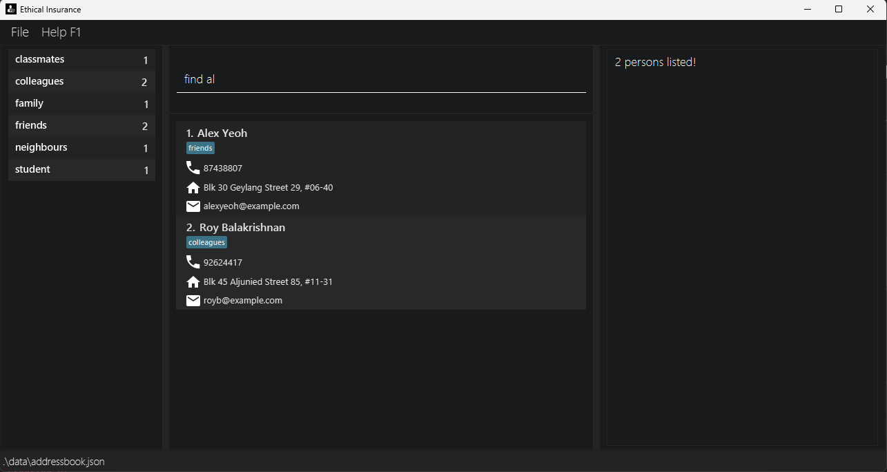

Ethical Insurance is a lightweight desktop contact management tool optimized for independent insurance agents managing 0~1000 customers entries.

* Table of Contents
  {:toc}

--------------------------------------------------------------------------------------------------------------------

## Quick start

1. Ensure you have Java `17` or above installed in your Computer. 
   **Mac users:** Ensure you have the precise JDK version prescribed [here](https://se-education.org/guides/tutorials/javaInstallationMac.html).

1. Download the latest `.jar` file from [here](https://github.com/AY2526S1-CS2103-F13-2/tp/releases).

1. Copy the file to the folder you want to use as the _home folder_ for your Ethical Insurance.

1. Open a command terminal, `cd` into the folder you put the jar file in, and use the `java -jar Ethical-Insurance.jar` command to run the application. 
   A GUI similar to the below should appear in a few seconds. Note how the app contains some sample data. 
   

1. Type the command in the command box and press Enter to execute it. e.g. typing **`help`** and pressing Enter will open the help window. 
   Some example commands you can try:

    * `list` : Lists all contacts.

    * `add n/John Doe p/98765432 e/johnd@example.com a/John street, block 123, #01-01` : Adds a contact named `John Doe` to the Address Book.

    * `delete 3` : Deletes the 3rd contact shown in the current list.

    * `clear` : Deletes all contacts.

    * `exit` : Exits the app.
    
    * `man` : Manual guide to get you started.

1. Refer to the [Features](#features) below for details of each command.

--------------------------------------------------------------------------------------------------------------------

## Keybinds

The following keybinds are available in Ethical Insurance

- Up Arrow (↑): Goes back to previous command in history.
- Down Arrow (↓): Goes forward to next command in history or empties command box when reach the end of history.

--------------------------------------------------------------------------------------------------------------------

## Features

### Notes about Command Format

| Rule                               | Description                                                                                | Example                                                                |
|------------------------------------|--------------------------------------------------------------------------------------------|------------------------------------------------------------------------|
| **Parameters in `UPPER_CASE`**     | Must be supplied by the user.                                                              | `add n/NAME` → `add n/John Doe`                                        |
| **Items in square brackets `[ ]`** | Are optional.                                                                              | `n/NAME [t/TAG]` → `n/John Doe t/friend` or `n/John Doe`               |
| **Items followed by `…`**          | Can be repeated multiple times (including zero).                                           | `[t/TAG]…` → none, `t/friend`, `t/friend t/family` (up to **15 tags**) |
| **Parameter order**                | Parameters can appear in any order.                                                        | `n/NAME p/PHONE_NUMBER` = `p/PHONE_NUMBER n/NAME`                      |
| **Extra parameters**               | Ignored for commands that take none (`help`, `list`, `exit`, `clear`).                     | `help 123` → interpreted as `help`, `list t/a s/abcd` is treated as `list t/a s/`                                     |
| **PDF copy-paste tip**             | If copying commands that span multiple lines, ensure spaces near line breaks are not lost. | —                                                                      |

---

> This section explains how to read and use command syntax throughout the User Guide

### Viewing Manuals: `man`

Shows manuals for commands.

Format: `man [COMMAND]`
* If `COMMAND` is not specified, shows a list of all available commands.
* If `COMMAND` is specified, shows the manual for the command.

---

### Viewing help : `help`

Shows a message explaining how to access the help page.

Format: `help`

---

### Listing all persons : `list`

Lists all entries in the address book.

Format: `list`

### Filtered list by tag : `list t/<your tag here>`

Filter by the respective tag(s) entered and displays a list of the filtered entries.

Format: `list t/<your tag here>` and for multiple tags `list t/<your tag here> t/<your tag here> ...`
Example: 
- list t/friends
- list t/travel t/high-cost
- list t/car t/medical t/expensive

### Create folder by tag : `list t/<your tag here> s/`

Allows you to create and save a custom folder.

Format: `list t/<your tag here> s/` and for multiple tags `list t/<your tag here> t/<your tag here> ... s/`
Output will be a folder with the names of the tags you have selected in alphabetical order.
PLEASE NOTE: Anything after the s/ will be ignored by the AB3 as only input before the first s/ will be registered.

Example:
- Input: list t/friends t/colleagues s/
- Output: Folder colleagues & friends created

### Delete folder by tag : `list t/<your tag here> d/`

Delete selected folder. Order does not matter for the deleting of folder, as long as
the respective tags are that folder will be deleted. PLEASE NOTE: Anything after the d/ will be ignored by the AB3 as only input before the first d/ will be registered.
And you can only delete 1 folder at a time, adding more tags is just for you to find the respective folder based on more than 1 tag.

Format: `list t/<your tag here> d/` and for multiple tags based folders  `list t/<your tag here> t/<your tag here> ... d/`

Example
- Input: list t/cars d/
- Output: Deleted folder "cars"
- Input: list t/cars t/medical t/age d/
- Output: Deleted folder "age & cars & medical"

---

### Adding a person: `add`

Adds a person to the address book.

Format: `add n/NAME p/PHONE_NUMBER e/EMAIL a/ADDRESS [t/TAG]…​`

> 💡 **Tip:**  
> A person can have any number of tags (including 0).

> ⚠️ **Duplicate Rule:**  
> Another person with the same **`NAME`** and **`PHONE_NUMBER`** is treated as a duplicate entry.

#### **⚠️ Criteria for Same Person**

Two persons are considered the same if:
- They have the **same `NAME`** (case-insensitive), and
- They have the **same `PHONE_NUMBER`**.

Duplicate entries are not allowed in the address book.

---

**Examples**

* `add n/John Doe p/98765432 e/johnd@example.com a/John street, block 123, #01-01`
* `add n/Betsy Crowe t/friend e/betsycrowe@example.com a/Newgate Prison p/1234567 t/criminal`

### **Parameter Restrictions**

>All parameters must contain only printable ASCII characters.

**Name**
- Must start with a **letter or number**.
- Can contain **letters**, **spaces**, and the following special characters only:  
  `(space) , ( ) / . @ - '`
- Cannot contain **numbers** inside the name or any other special symbols.

**Examples**

| Valid       | Invalid |
|-------------|---------|
| Jean-Luc    | John123 |
| Tan         | Strauß  |
| Mei Ling    | José    |
| O’Connor    | John*   |
| Mary (Ann)  | John_   |
| Alex @ Home |         |

**Phone**
- Must be **3–15 digits** (to account for international numbers).
- Only digits (0–9) are allowed — **no spaces, letters, or symbols.**

**Examples**

| Valid           | Invalid      |
|-----------------|--------------|
| 94567802        | +65 98765432 |
| 82684533        | phone123     |
| 66265555        | 9011p041     |
| 123456789012345 | 9312 1534    |

**Email**
- Must be a **valid email address**, with:
    - An alphanumeric username
    - Optional special characters (`+`, `_`, `.`, `-`)
    - An `@` followed by a valid domain name

**Examples**

| Valid                  | Invalid         |
|------------------------|-----------------|
| johndoe@example.com    | johndoe@        |
| alice.smith-99@mail.co | alice@@mail.com |
| user+test@abc-def.com  | user@mail       |

**Address**
- Must **not be blank**.
- Must **start with a non-space** and **not end with a space**.
- Only printable ASCII characters allowed.

**Examples**

| Valid                        | Invalid                       |
|------------------------------|-------------------------------|
| 123 Main St, Block 5, #01-01 | " "                           |
| 42 Wallaby Way               | " Blk 456, Den Road, #01-355" |
| 7th Avenue, Apt 3            | "Blk 456, Den Road, #01-355 " |

#### **Tag**
- Tags are optional.
- Each person can have **up to 15 tags**.
- Tags can only contain **letters**, **numbers**, and **dashes (`-`)**.
- Please note for the '-', starting and trailing '-' will be rejected.
- Tags are **case-insensitive**. 
- Must not exceed 40 characters.

**Examples**

| Valid        | Invalid       |
|--------------|---------------|
| friend       | friend!       |
| family-member | family_member |
| project2025  | Project@2025  |
| a-was-here   | -abc or abc-  |
| helloworld   | hello world   |

---

### Editing a person : `edit`

Edits an existing person in the address book.

Format: `edit INDEX [n/NAME] [p/PHONE] [e/EMAIL] [a/ADDRESS] [{t/ OR at/ OR dt/}TAG]…​`

> 💡 `INDEX` refers to the number shown in the **current list view**, not a fixed ID.

> 💡 Example: if you use `find` first, `edit 1` edits the first result from that filtered list.
Editing is **undoable** using the [`undo`](#undoing-the-last-action-undo) command.

#### Description
* Edits the person at the specified `INDEX`. The index refers to the index number shown in the displayed person list. The index **must be a positive integer** 1, 2, 3, …​
* At least one of the optional fields must be provided.
* Existing values will be updated to the input values.
* When using `t/TAG`, the existing tags of the person will be removed.
* You can only use either of these tag editing commands once per `edit` command.
* You can remove all the person’s tags by typing `t/` without
  specifying any tags after it.
* Use `at/TAG` to add on to **existing** tags.
* Use `dt/TAG` to remove from **existing** tags.
* Each person after editing can only contain a maximum of 15 tags.

Examples:
*  `edit 1 p/91234567 e/johndoe@example.com` Edits the phone number and email address of the 1st person to be `91234567` and `johndoe@example.com` respectively.
*  `edit 2 n/Betsy Crower t/` Edits the name of the 2nd person to be `Betsy Crower` and clears all existing tags.
*  `edit 3 at/InsuranceA` Adds the tag `InsuranceA` on to existing tags of the 3rd person.
*  `edit 3 dt/InsuranceA` Deletes the tag `InsuranceA` from the existing tags of the 3rd person.

- Edits the person at the specified **`INDEX`** in the currently displayed list.  
  The index **must be a positive integer** (1, 2, 3, …).
- At least **one** of the optional fields must be provided.
- Only the specified fields are updated, other fields remain unchanged.
- When editing tags, the existing tags are **replaced**, not added cumulatively.
- To remove **all** of a person’s tags, type `t/` with nothing following it.
- Each person can have up to **15 tags** after editing.
- **Parameter restrictions:** Same as those in the [`add`](#adding-a-person-add) command.

---

#### Examples

| Command                                   | Description                                                              |
|-------------------------------------------|--------------------------------------------------------------------------|
| `edit 1 p/91234567 e/johndoe@example.com` | Updates the **phone** and **email** of the 1st person.                   |
| `edit 2 n/Betsy Crower t/`                | Changes the **name** of the 2nd person and **clears all existing tags**. |

---

### Locating persons by name: `find`

Finds clients whose **name, phone number, or email** contain any of the given keywords (case-insensitive, partial matches allowed).
Format: `find KEYWORD [MORE_KEYWORDS]`

---

**Description**

- The search is **case-insensitive**.  
  Example: `hans` matches `Hans`, `HANS`, and `Johanssen`.
- **Partial matches** are supported.  
  Example: `li` matches `David Li`, `Lina Tan`, and `charlie@gmail.com`.
- Searches across **name**, **phone**, and **email** fields.
- Keyword order **does not matter**.  
  Example: `Alex 9123` matches clients whose name contains “Alex” or phone contains “9123”.
- Uses **OR semantics** — a client is listed if **any** keyword matches any field.
- Blank or invalid inputs (e.g., spaces only or non-printable Unicode) are ignored safely.

---

**Examples**

| Command                    | Description / Result                                                |
|----------------------------|---------------------------------------------------------------------|
| `find alex`                | Lists all clients with “alex” in their name, phone, or email.       |
| `find 9123`                | Lists clients whose phone number contains “9123”.                   |
| `find gmail.com`           | Lists clients using Gmail addresses.                                |
| `find alex 9123 gmail.com` | Lists clients whose name, phone, or email matches any of the terms. |

> 💡 `find al` returns `Alex Yeow` and `Roy Balakrishnan`

> 💡 `find alex 9927` returns `Alex Yeoh`, `Bernice Yu` 

---

### Deleting a person : `delete`

Deletes the specified person from the address book.

Format: `delete INDEX`

* Deletes the person at the specified `INDEX`.
* The index refers to the index number shown in the displayed person list.
* The index **must be a positive integer** 1, 2, 3, …​

Examples:
* `list` followed by `delete 2` deletes the 2nd person in the address book.
* `find Betsy` followed by `delete 1` deletes the 1st person in the results of the `find` command.

---

### Clearing all entries : `clear`

Clears all entries from the address book.

Format: `clear`

---

### Declaring Features and Tags for Statistics: `biz`

Declares Features and Tags to group Tags by Features for statistics. Adding those Categories as tags to People will allow them to be considered for statistics.
Applying this command on a Feature with the same name will overwrite the existing Feature-Tags pair. This command is undoable.

Format: `biz f/<your feature here> t/<tag 1> t/<tag 2>`

* Add multiple tags for aggregation of a Feature.

Examples: [See result in 'Viewing Summary Statistics']
* `biz f/Plan t/A t/B t/C` declares the Feature "Plan" and the Categories "A", "B" and "C" for statistics.
* `biz f/Gender t/Male t/Female t/Other` declares this Feature and its Categories.

**Parameter restrictions:**
***All parameters contains only printable ASCII characters***
*** Please note that Biz tags are different from the entry Tags above.
- **Feature and Tag:** A tag name should contain only English letters, digits, or '-' (dash). It must start and end with a letter or digit, and must not exceed 40 characters. Tags are case-insensitive.
- Example: friend, VIP, family-member, project2025_

### Undeclaring Features and Tags from Statistics: `unbiz`

Undeclares Features and their corresponding Tags.
This command is undoable.

Format: `unbiz f/<your feature 1 here> f/<your feature 2 here>`

* Undeclare multiple Features by chaining `t\` prefixes together.

Examples:
* `biz f/Plan` undeclares the Feature "Plan" and its associated tags from statistics.
* `biz f/Gender f/Plan` undeclares these Features: "Plan", "Gender".

**Parameter restrictions:**
***All parameters contains only printable ASCII characters***
- **Feature and Tag:** A tag name should contain only English letters, digits, or '-' (dash). It must start and end with a letter or digit, and must not exceed 40 characters. Tags are case-insensitive.  
  _Example: friend, VIP, family-member, project2025_

### Viewing Summary Statistics: `stats`

Shows Summary Statistics on Customers in the address book.

Statistics will be summarized according to Features and Tags declared by User using the `biz` command.

Format: `stats`

**Example:**
If the following was declared in `biz` command,

Key - Features: Tags
* Plan: A, B, C -> `biz f/Plan t/A t/B t/C` (Where f/ is the name of the group in this case it is "Plan" and the tags associated with it is A, B and C).
* Gender: Male, Female, Other -> `biz f/Gender t/Male t/Female t/Other` (Where f/ is the name of the group in this case it is "Gender" and the tags associated with it is Male, Female and Other).

Sample table view
Total Number of Customers in AddressBook: 6

Gender  | Number of people 
Male   | 0
Female  | 0
Other  | 0

Total for Feature: 0
Average: 0.00
Max Tag: Male & Female & Other (0 people)
Min Tag: Male & Female & Other (0 people)
---------------------------------------------

Plan | Number of people
A   | 1
B   | 0
C   | 0

Total for Feature: 1
Average: 0.33
Max Tag: A (1 person)
Min Tag: B & C (0 people)
---------------------------------------------

---

### Undoing the last action : `undo`

Reverts the most recent mutable action (add, delete, clear, or edit) performed during the current runtime.

Format: `undo`

* Only actions that change the address book (add, delete, clear, edit, biz, unbiz) can be undone.
* Multiple undo operations can be performed in sequence to revert several actions, as long as they are all mutable actions from the current session.
* Undo is only available for actions performed since the application was started (current runtime).

**Examples:**
* After adding a person, running `undo` will remove the newly added person.
* After deleting a person, running `undo` will restore the deleted person.
* After editing a person, running `undo` will revert the changes made.
* After clearing the address book, running `undo` will restore all previously deleted entries.

---

### Redoing the last undone action : `redo`

Reapplies the most recent sequence of undone mutable actions, as long as no new action has been performed since the last undo.

Format: `redo`

* Only actions that were previously undone using `undo` can be redone.
* If you perform a new action (add, delete, clear, edit) after undoing, the redo history is cleared and you cannot redo the previous actions.
* Multiple redo operations can be performed in sequence to reapply several undone actions, as long as no new action has interrupted the sequence.

**Examples:**
* After undoing an add, running `redo` will add the person back again.
* After undoing a delete, running `redo` will delete the person again.
* If you undo an edit and then perform a new add, you cannot redo the undone edit.

---

### Exiting the program : `exit`

Exits the program.

Format: `exit`

---

### Saving the data

Ethical Insurance address book data are saved in the hard disk automatically after any command that changes the data. There is no need to save manually.

---

### Editing the data file

Ethical Insurance address book data are saved automatically as a JSON file `[JAR file location]/data/addressbook.json`. Advanced users are welcome to update data directly by editing that data file.

:exclamation: **Caution:**
If your changes to the data file makes its format invalid, Ethical Insurance will discard all data and start with an empty data file at the next run, *without any warning*. Hence, it is recommended to take a backup of the file before editing it. 
Furthermore, certain edits can cause Ethical Insurance to behave in unexpected ways (e.g., if a value entered is outside of the acceptable range). Therefore, edit the data file only if you are confident that you can update it correctly.

---

### Archiving data files `[coming in v2.0]`

_Details coming soon ..._

--------------------------------------------------------------------------------------------------------------------

## FAQ

**Q**: How do I transfer my data to another Computer? 
**A**: Install the app in the other computer and overwrite the empty data file it creates with the file that contains the data of your previous Ethical Insurance home folder.

**Q**: Why when I issue add/edit command, something appears on the right side of the application? 
**A**: When issuing an add or edit command, a live preview of what you are adding or editing will appear on the right side of your screen. This allows you to quickly verify that the information you entered is correct. When an invalid field is detected (e.g., `n/X Æ A-12`), that field will be highlighted in red to indicate an error. Currently, duplicate users are not flagged (coming soon!).

--------------------------------------------------------------------------------------------------------------------

## Known issues

1. **When using multiple screens**, if you move the application to a secondary screen, and later switch to using only the primary screen, the GUI will open off-screen. The remedy is to delete the `preferences.json` file created by the application before running the application again.
2. **If you minimize the Help Window** and then run the `help` command (or use the `Help` menu, or the keyboard shortcut `F1`) again, the original Help Window will remain minimized, and no new Help Window will appear. The remedy is to manually restore the minimized Help Window.

--------------------------------------------------------------------------------------------------------------------

## Command summary

| Action                          | Format, Examples                                                                                                                                                      |
|---------------------------------|-----------------------------------------------------------------------------------------------------------------------------------------------------------------------|
| **Manual**                      | `man [COMMAND]`   e.g., `man add`                                                                                                                                  |
| **Add**                         | `add n/NAME p/PHONE_NUMBER e/EMAIL a/ADDRESS [t/TAG]…​`   e.g., `add n/James Ho p/22224444 e/jamesho@example.com a/123, Clementi Rd, 1234665 t/friend t/colleague` |
| **Clear**                       | `clear`                                                                                                                                                               |
| **Delete**                      | `delete INDEX`  e.g., `delete 3`                                                                                                                                   |
| **Edit**                        | `edit INDEX [n/NAME] [p/PHONE_NUMBER] [e/EMAIL] [a/ADDRESS] [t/TAG]…​`  e.g.,`edit 2 n/James Lee e/jameslee@example.com`                                           |
| **Find**                        | `find KEYWORD [MORE_KEYWORDS]`  e.g., `find James Jake`                                                                                                            |
| **List**                        | `list`                                                                                                                                                                |
| **List by tag**                 | `list t/<your tag here>`   e.g., `list t/friends`                                                                                                                  |
| **Create and save folder**      | `list t/<your tag here> s/`   e.g., `list t/friends s/`                                                                                                            |
| **Delete folder**               | `list t/<your tag here> d/`   e.g., `list t/friends d/`                                                                                                            |
| **Help**                        | `help`                                                                                                                                                                |
| **Declare Features and Tags**   | `biz f/[FEATURE] t/[TAG]...`   e.g. `biz f/Plan t/A t/B`                                                                                                           |
| **Undeclare Features and Tags** | `unbiz f/[FEATURE]...`   e.g. `unbiz f/Plan f/Gender`                                                                                                              |
| **Stats**                       | `stats`                                                                                                                                                               |
| **Undo**                        | `undo`                                                                                                                                                                |
| **Redo**                        | `redo`                                                                                                                                                                |
| **Exit**                        | `exit`                                                                                                                                                                |
