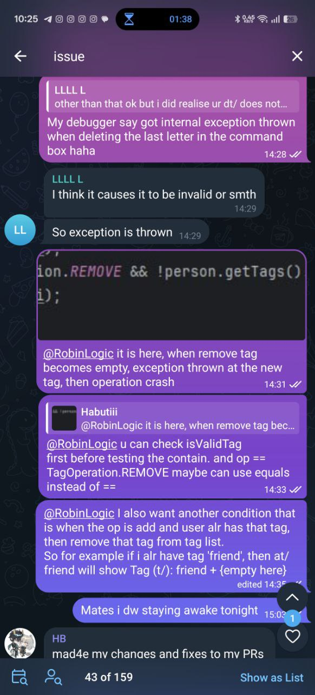
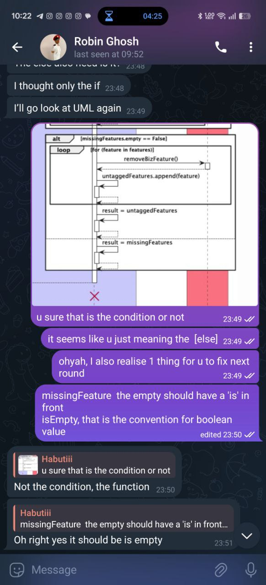
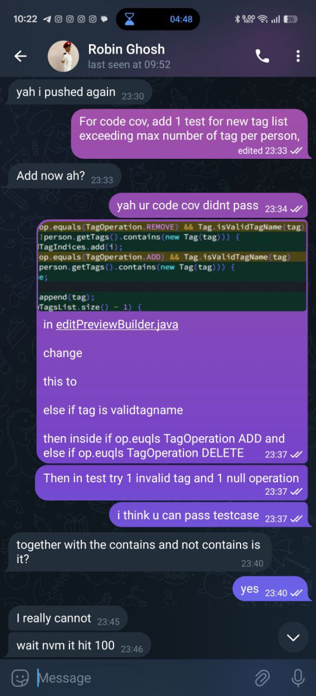
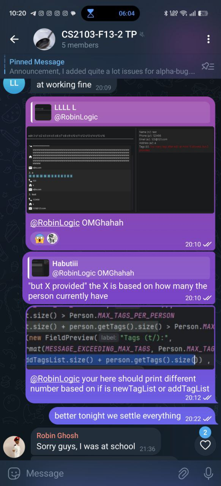

### ---
layout: page
title: Habutiii's Project Portfolio Page
---

### Project: Ethical Insurance

Ethical Insurance is a modernized version of AddressBook-Level 3, re-imagined as a lightweight desktop contact management tool tailored for independent insurance agents managing 0 – 1000 customer entries.

Given below are my contributions to the project.

* **Code contributions**: 
  * Major files changed:
    * src/main/java/seedu/address/logic/commands/UndoCommand.java
    * src/main/java/seedu/address/logic/commands/RedoCommand.java
    * src/main/java/seedu/address/logic/commands/ClearCommand.java (updated)
    * src/main/java/seedu/address/logic/commands/AddCommand.java (updated)
    * src/main/java/seedu/address/logic/commands/DeleteCommand.java (updated)
    * src/main/java/seedu/address/ui/CommandBox.java (key handlers)
    * src/main/java/seedu/address/ui/PersonCard.java (realtime ui responsiveness)
    * src/test/java/... (unit/integration tests for undo, redo, history)
    * Notes: the files above are just a sample of the major files changed, many other files were modified for integration and testing.
    
  * **New Feature**: Added undo/redo for commands
      * What it does: Implements multi-level undo and redo: users can undo the last state-changing command one step at a time, and previously undone commands can be reapplied with redo. Undoable commands include state-mutating commands such as add, delete, edit and clear; read-only commands (e.g., list, help) are ignored by the undo stack.
      * Justification: Reduces user fear of making mistakes when using CLI or GUI, improving overall usability and robustness. This is especially helpful in an educational setting where students experiment frequently and need a low-cost way to recover from errors.
      * Highlights:
          - Design: Introduced a command execution history feature backed by two stacks (undo and redo) to order commands and revert and re-apply their effects. Each mutable command will have an undo function that restores the previous state and repeated execution re-applies the changes. These functions are triggered by the UndoCommand and RedoCommand classes.
          - Integration: Changed several existing commands that I consider them as mutable (AddCommand, DeleteCommand, EditCommand, ClearCommand, ListCommand, BizCommand and UnbizCommand) to implement the undo FEATURE.
          - Testing: Added unit and integration tests covering command execution, undo/redo sequences, and corner cases (undo after failed command, undo of compound operations).
      * Credits: Core design follows the Command pattern and well-known memento ideas. Implementation and tests are my original work. No third-party library was used for undo/redo.

  * **New Feature**: Command history with up/down navigation
      * What it does: Records executed commands in a history buffer and allows navigation using up/down keys in the CLI and the GUI command box. The user can browse, edit, and re-execute previous commands.
      * Justification: Speeds up command entry, reduces repetition and typos, and provides a common shell-like experience that users expect.
      * Highlights:
          - Implementation: Added an input command history component that stores the ran commands in current runtime, exposes a simple function for navigation.
          - Integration: Connected key event handlers in the JavaFX command box to the history iterator.
          - Tests: Added tests for history navigation and persistence behavior.
      * Credits: Inspired by typical shell history behavior. Implementation is custom and tailored to the application.
    
  * **Enhancements to existing features**: Input validation and constraints 
      - Designed and implemented input restrictions to accept only ASCII characters for user-submitted fields to avoid encoding/normalization issues across platforms.
      - Added field-level constraints and validation rules for core components:
          - Name: enforced length limits, disallowed control characters, defined allowed punctuation.
          - Address: trimmed/normalized whitespace, enforced max length and disallowed problematic non-ASCII characters.
          - Phone number: allowed numeric characters and configurable separators only, added pattern checks and length validation.
          - Tag: limited allowed characters to alphanumerics and a small set of punctuation, enforced max length and uniqueness per contact.
      - Integration: Validation is implemented at the parser and model layers so invalid input is rejected early with user-friendly error messages. UI also shows inline validation feedback.
      - Testing: Added unit tests for parser-level validation, model invariants, and end-to-end tests verifying UI error messages and acceptance of valid inputs.
      - Justification: These constraints improve data consistency, reduce downstream parsing/serialization bugs, and simplify cross-platform handling in an educational environment.
      - Notes: Kept rules configurable for future relaxation if needed (e.g., internationalization).
    
  * **Enhancements to existing features**: UI redesign:
      - Redesigned the main UI to improve visual hierarchy and allow additional components to be displayed:
          - New layout places summary panels, contact list, and a resizable details pane for more fields (tags, notes, upcoming events).
          - Introduced a responsive layout so more components can be shown on wider screens without cluttering small displays.
          - Increased responsiveness and adaptability of the UI to different window sizes and wraps long text appropriately.
      - Integration: Updated UI controllers and view models to support additional components and to keep logic/test separation.
      - Highlights: Improved accessibility, UI responsiveness, and overall user experience.
      - Testing: Added UI tests capturing layout and component rendering across different window sizes and verifying that the command box and history still work correctly with the new layout.
  
  * **Enhancements to existing features**: Improved storage settings:
      - Application now able to detect permission issues in Windows
      - Improved save tag storage to a more efficient format.
      - Fixed bugs from AB3 that application window size preference was not saved correctly on exit [#315]()

* **Project management**:
    * Assisted in sprint planning and retrospective sessions to improve team workflow.
    * Helped coordinate tasks among team members to ensure timely completion of features.
    * Actively setting announcements in the group to remind team members of upcoming deadlines, meetings, and important project milestones.

* **Documentation**:
    * User Guide:
        * Maintained and regularly updated the User Guide (UG) to the latest UG version, kept examples, screenshots, and command references in sync with code changes and releases (PR [#112]() [#82]()).
    * Developer Guide:
        * Documented the design and implementation details of the `clear` feature and the `undo`/`redo` architecture (class responsibilities, sequence diagrams and use cases) (PR [#112]() [#148]() [#318]()).

* **Review/mentoring contributions**:
    * Reviewed **most** of the PRs in the project
      * Some PRs (with non-trivial review comments): [#112](), [#313](), [#166](), [#78]().
      * These are a portion of the PRs that I have provided design feedback, suggested corrections and simplifications.
    * Also helped team members to fix bugs related to their features/components (PRs [#337]() [#213](), [#194](), [#147](), [#96]()).
    * Reported bugs and cross-team suggestions during integration testing for the class project: [#104](), [#97]()
    * Actively participated in discussions helping others integrate undo ideas, resolve debug issues and pass the code coverage checks.
      * Mentored junior team members on Git workflows, testing strategies, and design patterns used in the project.
      * Some evidence:  
        
        
        
        
        
   

